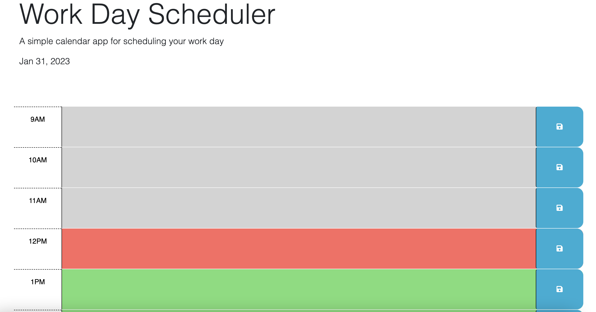

# Work-Day-Scheduler

## Description

Using starter code, added the following features to a standard work day schedule: 

Color coordination for past, current, and future hours
Current date reflected at top
Ability for user to enter and save text content in local storage

## Installation

Site deployed. URL: https://andreaginn.github.io/Work-Day-Scheduler/

